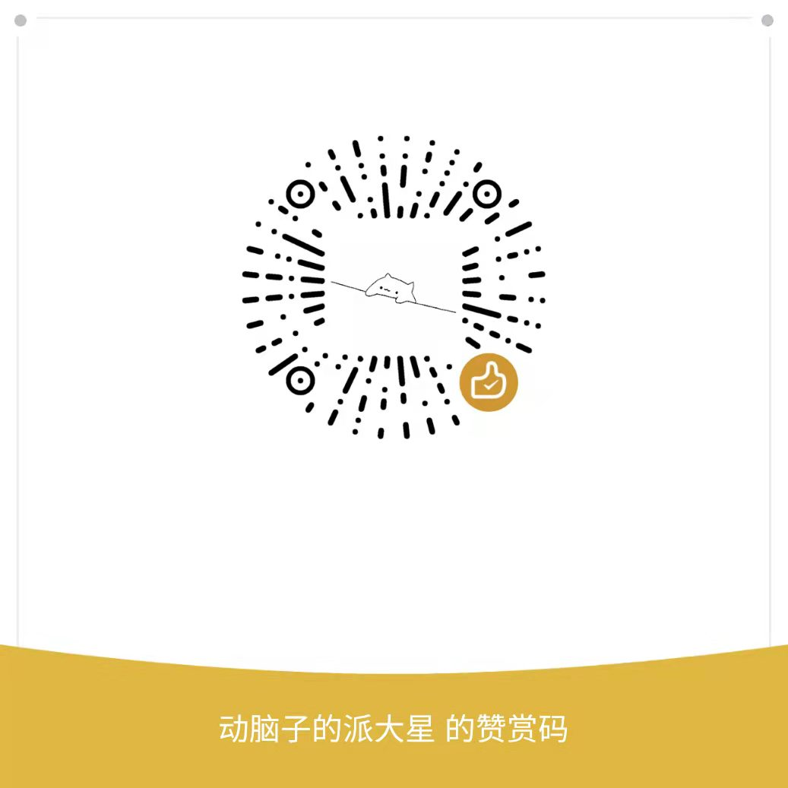

## Swag_Library_Reserve
<h2>原程序是本校学长luoshenshen写的，由于学长很忙，本人借此更新一下<h2>
<h4>加密字段获取：不用execjs执行了，直接字典键值对应，提高抢座速度。<h4>
<h4>验证码识别：利用ddddocr这个库，开源好用，不需要再用百度识别了</h4>
<h4>签到：新增签到功能，可以无视距离进行签到(然后我就半夜12点在宿舍签到，到晚上12点退座。一天学习24个小时hhhhhhhhh,签到功能只能财大的才能使用，别的学校需要重新抓包<h4>
<h4>可视化界面：为了最大限度的提高抢座速度，我把做好的可视化界面给删除了..</h4>

<h1>使用说明</1>
<h4>今日预约：直接双击打开today.py,输入sessid会自动匹配空余楼层和座位,果想改成指定位置选座，需手动更改today.py,loor和data_key变量。</h4>
<h4>明日预约：直接右键以记事本的方式打开tomorrow.py,更改其中的cookie，例如改为cookie = np.array(['60fc8e71230136545782eb5cb2339b4e','10081','6,11'])中括号分别为sessid，楼层编号和具体座位，然后如果想设置时间的话可以加入到windows自带的定时任务。我就设的是19:50启动，也不用在python里写时间模块了。</h4>
<h4>签到：双击打开signin.py会出现个小窗口，再点击签到，输入sessid，确认信息，确认签到即可。</h4>
<h4>抓包教程：可参考https://space.bilibili.com/85750427,也可以问我。</h4>
<h4>最近也比较倒霉，今早被人恶意举报7点半开馆，7点三十一举报我座位无人.....7天小黑屋,欢迎大家支持一下我o(╥﹏╥)o</h4>
</img>
